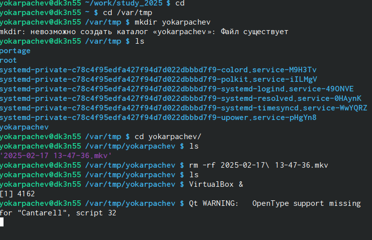
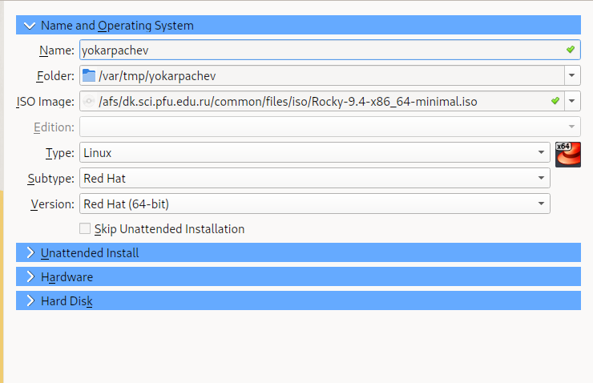
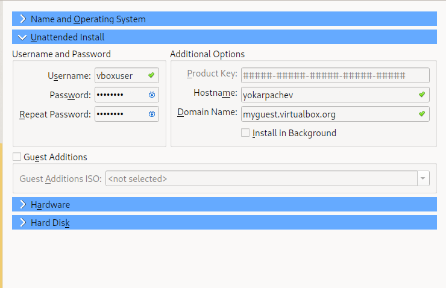
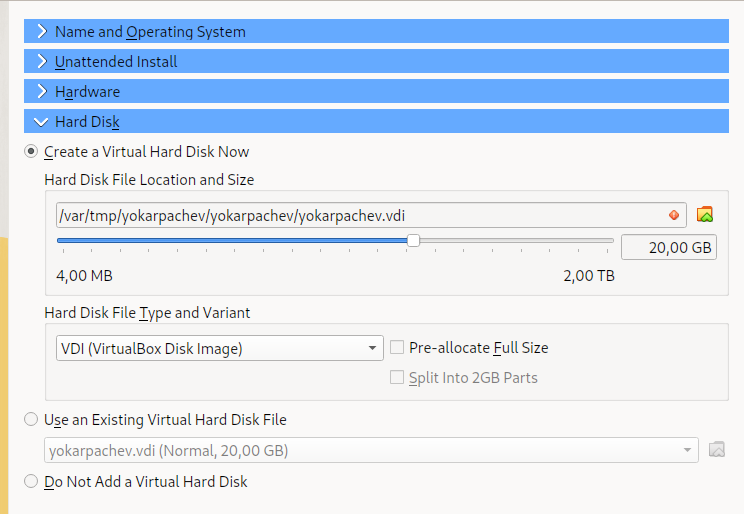
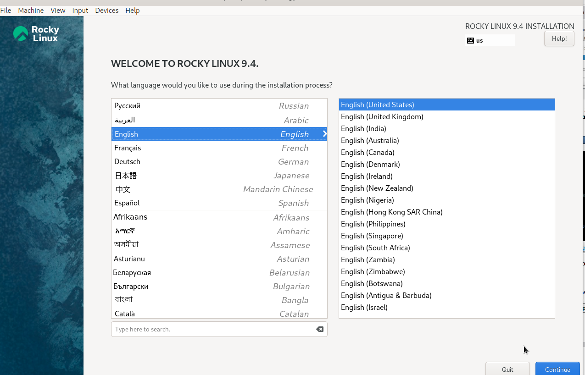
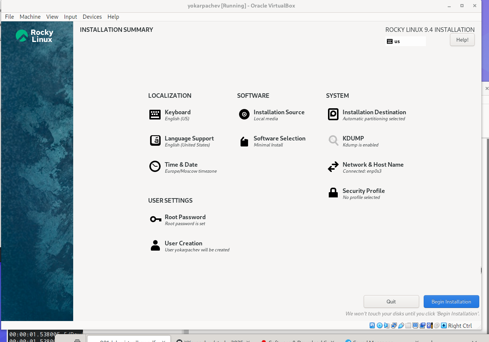
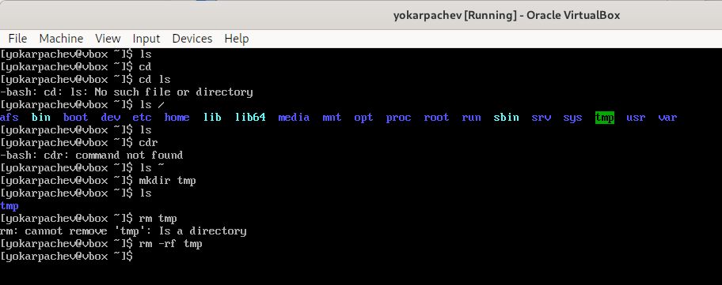

---
## Front matter
lang: ru-RU
title: Структура научной презентации
subtitle: Простейший шаблон
author:
  - Карпачев Я. О.
institute:
  - Российский университет дружбы народов, Москва, Россия

## i18n babel
babel-lang: russian
babel-otherlangs: english

## Formatting pdf
toc: false
toc-title: Содержание
slide_level: 2
aspectratio: 169
section-titles: true
theme: metropolis
header-includes:
 - \metroset{progressbar=frametitle,sectionpage=progressbar,numbering=fraction}
 - '\makeatletter'
 - '\beamer@ignorenonframefalse'
 - '\makeatother'
---

# Информация

## Докладчик

:::::::::::::: {.columns align=center}
::: {.column width="70%"}

  * Карпачев Я. О.
  * студент
  * Российский университет дружбы народов

:::
::: {.column width="30%"}

:::
::::::::::::::

# Вводная часть

## Цели и задачи

Целью данной работы является приобретение практических навыков
установки операционной системы на виртуальную машину, настройки ми-
нимально необходимых для дальнейшей работы сервисов.

1. создать папку в нужном месте

2. открыть virtual box и выполнить настройку

3. сделать настройку виртуальной машины

4. запустить виртуальную машину и выполнить внутренню настройку

5. установка и перезагрузка

## создаем папку /var/tmp/yokarpachev

{#fig:001 width=70%}

## Отрыть виртуал бокс и изменить дефолтную папку для машин на /var/tmp/yokarpachev

## Сделать настройку машины

{#fig:002 width=70%}
{#fig:003 width=70%}
{#fig:004 width=70%}
{#fig:005 width=70%}

## запустить виртуальную машину и выполнить внутренню настройку

{#fig:002 width=70%}

{#fig:007 width=70%}

## установка и перезагрузка

{#fig:008 width=70%}
