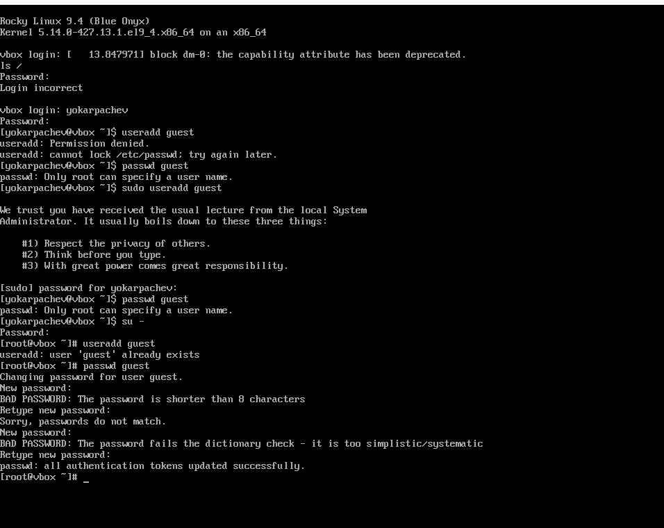
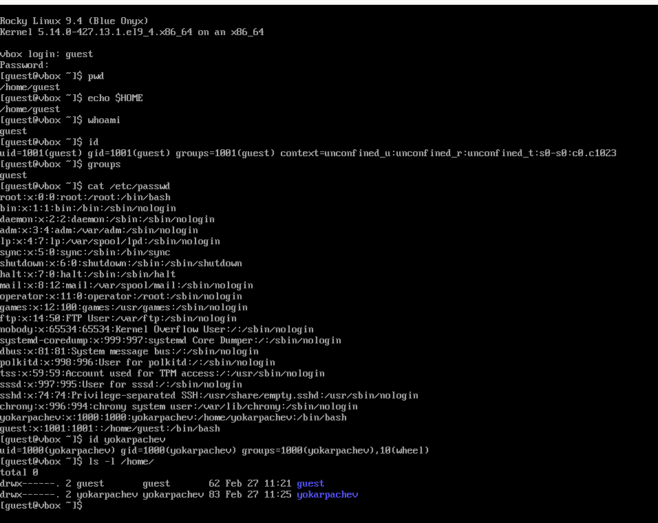
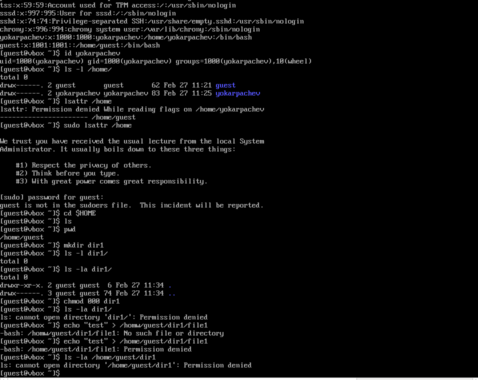

---
## Front matter
lang: ru-RU
title: Структура научной презентации
subtitle: Простейший шаблон
author:
  - Карпачев Я. О.
institute:
  - Российский университет дружбы народов, Москва, Россия

## i18n babel
babel-lang: russian
babel-otherlangs: english

## Formatting pdf
toc: false
toc-title: Содержание
slide_level: 2
aspectratio: 169
section-titles: true
theme: metropolis
header-includes:
 - \metroset{progressbar=frametitle,sectionpage=progressbar,numbering=fraction}
 - '\makeatletter'
 - '\beamer@ignorenonframefalse'
 - '\makeatother'
---

# Информация

## Докладчик

:::::::::::::: {.columns align=center}
::: {.column width="70%"}

  * Карпачев Я. О.
  * студент
  * Российский университет дружбы народов

:::
::: {.column width="30%"}

:::
::::::::::::::

# Вводная часть

## Цели и задачи

Получение практических навыков работы в консоли с атрибутами фай-
лов, закрепление теоретических основ дискреционного разграничения до-
ступа в современных системах с открытым кодом на базе ОС Linux1

## Этап 1

 Меняем пользователя на root чтоб получить права для создания пользователя, создаем его и вводим пароль для него

{#fig:001 width=70%}

# Этап 2

 Заходим в нового пользователя проверяем что мы действительно в папке домашней, проверяем что мы действительно тот пользователь о котором думаем (получаем краткую информацию с помощью id), выводем все известные пароли ищем нашего основного пользователя и получаем краткую информацию о нем (различия в госте и основы - на 1 больше id и тд), получаем данные о атрибутах в /home/

{#fig:002 width=70%}

# Этап 3

 Пытаемся проверить атрибуты (неполучается так как нету прав), создаем dir1 определяем права доступа снимаем все арибуты, попытаемся создать файл - ничего не получается так как мы сняли все права, команды не оказывают никакого эффекта (нет прав).

{#fig:003 width=70%}

# Этап 4

| Операция                 | Минимальные права на директорию | Минимальные права на файл |
|------------------------------|--------------------------------------|--------------------------------|
| Создание файла           | w + x                            | –                              |
| Удаление файла           | w + x                            | –                              |
| Запись в файл            | x                                | w                          |
| Чтение файла             | x                                | r                          |
| Переименование файла     | w + x                            | –                              |
| Создание поддиректории   | w + x                            | –                              |
| Удаление поддиректории   | w + x                            | –                              |

