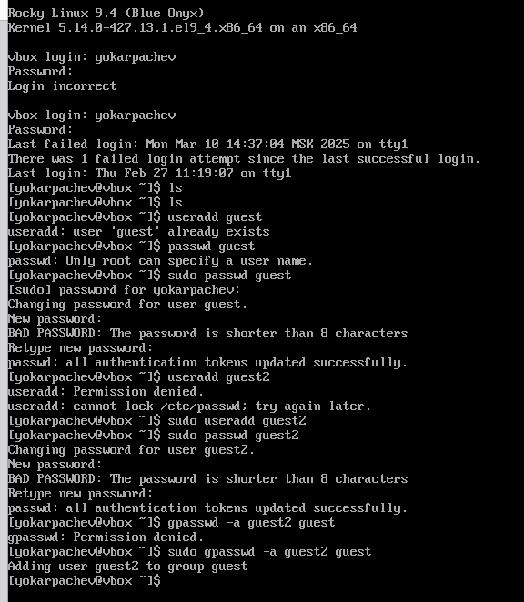
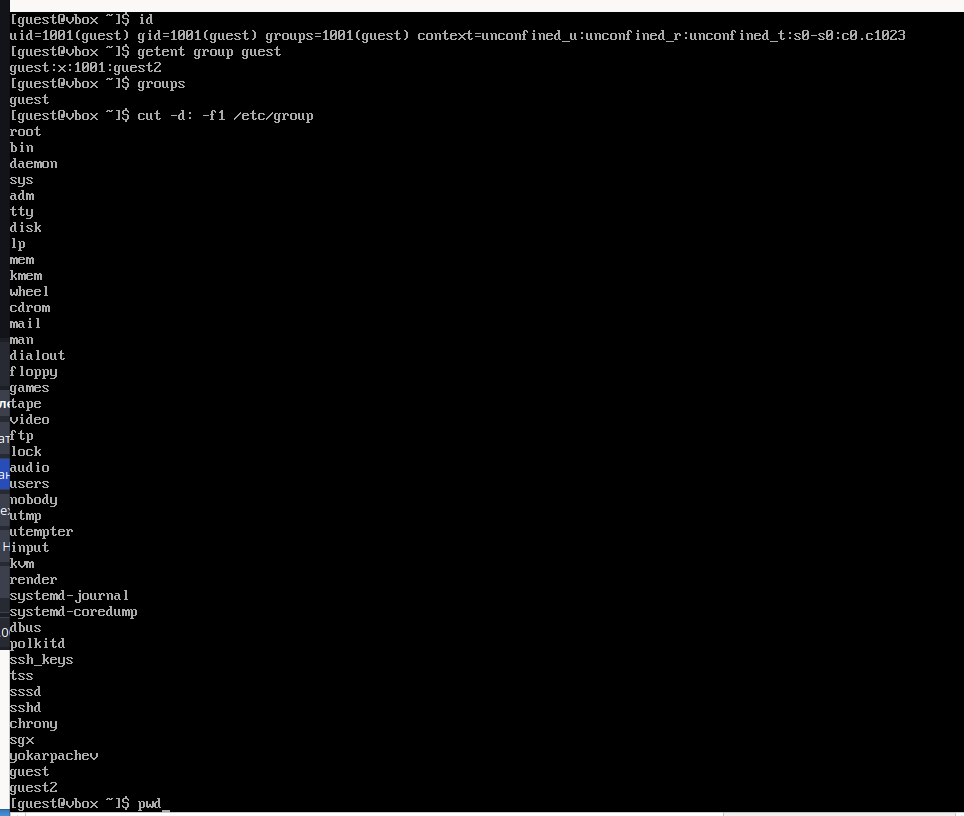
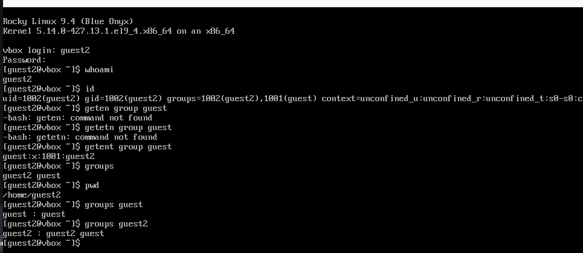
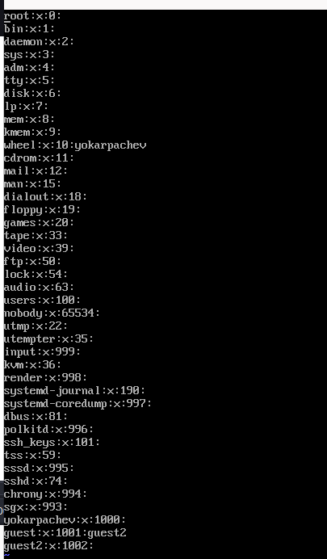
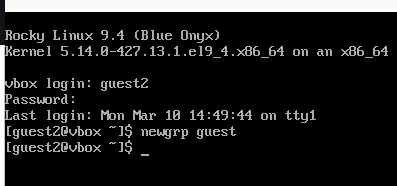
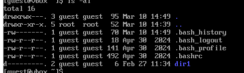

---
## Front matter
lang: ru-RU
title: Структура научной презентации
subtitle: Простейший шаблон
author:
  - Карпачев Я. О.
institute:
  - Российский университет дружбы народов, Москва, Россия

## i18n babel
babel-lang: russian
babel-otherlangs: english

## Formatting pdf
toc: false
toc-title: Содержание
slide_level: 2
aspectratio: 169
section-titles: true
theme: metropolis
header-includes:
 - \metroset{progressbar=frametitle,sectionpage=progressbar,numbering=fraction}
 - '\makeatletter'
 - '\beamer@ignorenonframefalse'
 - '\makeatother'
---

# Информация

## Докладчик

:::::::::::::: {.columns align=center}
::: {.column width="70%"}

  * Карпачев Я. О.
  * студент
  * Российский университет дружбы народов

:::
::: {.column width="30%"}

:::
::::::::::::::

# Вводная часть

## Цели и задачи

Получение практических навыков работы в консоли с атрибутами фай-
лов для групп пользователей

## Этап 1

Логинемся через корень  создаем двоих юзеров, ставим на всех пароль, создаем и определяем пользователей в группы.

{#fig:001 width=70%}

# Этап 2

Логинемся по отдельности в каждого пользователя и получаем информацию, айди, в каких группах состоит пользователь и какие группы вообще есть (для 1го пользователя) (для pwd - /home/имяюзера)

{#fig:002 width=70%}

# Этап 2

{#fig:003 width=70%}

# Этап 3

Сравниваем информацию с файлом /etc/group/, действительно имена наших пользователей + групп там присутствуют.

{#fig:004 width=70%}

# Этап 4

Создаем через второго пользователя новую группу

{#fig:005 width=70%}

# Этап 5

Снимаем все разрешения с файла и проверяем что действительно снялись

{#fig:006 width=70%}

# Этап 6

Заполняем таблицу

| Операция                  | Минимальные права на директорию | Минимальные права на файл |
|---------------------------|---------------------------------|---------------------------|
| Создание файла           | w + x                           | – (не требуется)          |
| Удаление файла           | w + x                           | – (не требуется)          |
| Чтение файла             | x (если имя файла известно)     | r                         |
| Запись в файл            | x (для доступа к самому файлу)  | w                         |
| Переименование файла     | w + x                           | – (не требуется)          |
| Создание поддиректории   | w + x                           | – (не требуется)          |
| Удаление поддиректории   | w + x                           | – (не требуется)          |

Забыл включить запись
