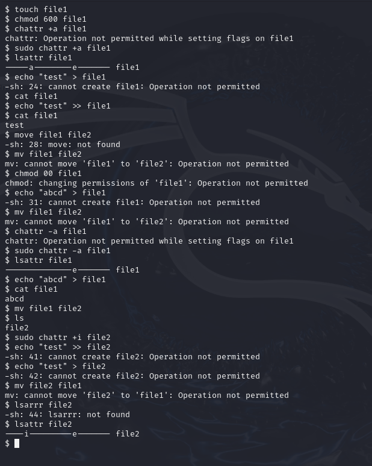

---
## Front matter
lang: ru-RU
title: Структура научной презентации
subtitle: Простейший шаблон
author:
  - Карпачев Я. О.
institute:
  - Российский университет дружбы народов, Москва, Россия

## i18n babel
babel-lang: russian
babel-otherlangs: english

## Formatting pdf
toc: false
toc-title: Содержание
slide_level: 2
aspectratio: 169
section-titles: true
theme: metropolis
header-includes:
 - \metroset{progressbar=frametitle,sectionpage=progressbar,numbering=fraction}
 - '\makeatletter'
 - '\beamer@ignorenonframefalse'
 - '\makeatother'
---

# Информация

## Докладчик

:::::::::::::: {.columns align=center}
::: {.column width="70%"}

  * Карпачев Я. О.
  * студент
  * Российский университет дружбы народов

:::
::: {.column width="30%"}

:::
::::::::::::::

# Вводная часть

## Цели и задачи

Получение практических навыков работы в консоли с расширенными
атрибутами файлов

## Этап 1

- Касаемо снятия -а, перезапись будет работать (echo >) также как и переименование файла (mv).

- Касаемо -i (immutable), как следует из название это запрещает делать перезаписывания и дополнения вообще в целом, так что ни одна команда не сработает.

## Этап 1

{#fig:001 width=70%}

## Вывод

В результате выполнения работы я повысил свои навыки использова-
ния интерфейса командой строки (CLI), познакомился на примерах с тем,
как используются основные и расширенные атрибуты при разграничении
доступа. Имел возможность связать теорию дискреционного разделения
доступа (дискреционная политика безопасности) с её реализацией на прак-
тике в ОС Linux. Составил наглядные таблицы, поясняющие какие опера-
ции возможны при тех или иных установленных правах. Опробовал дей-
ствие на практике расширенных атрибутов «а» и «i»
Забыл включить запись
