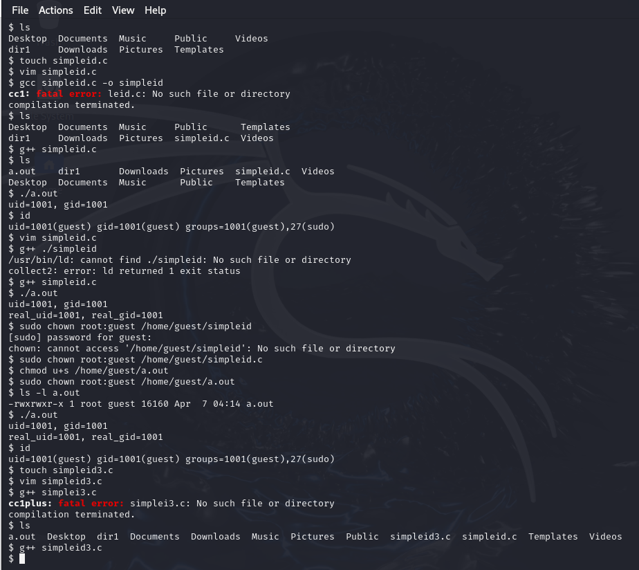
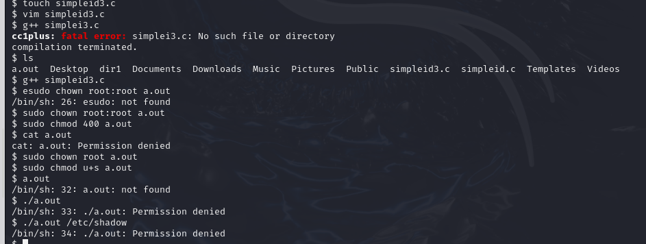
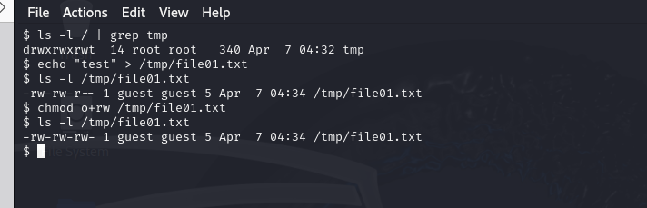
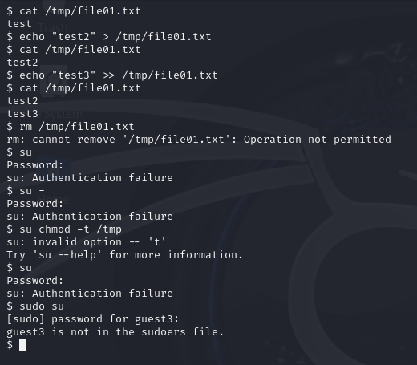
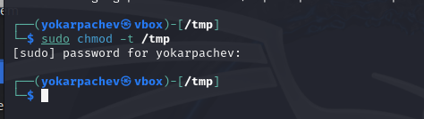
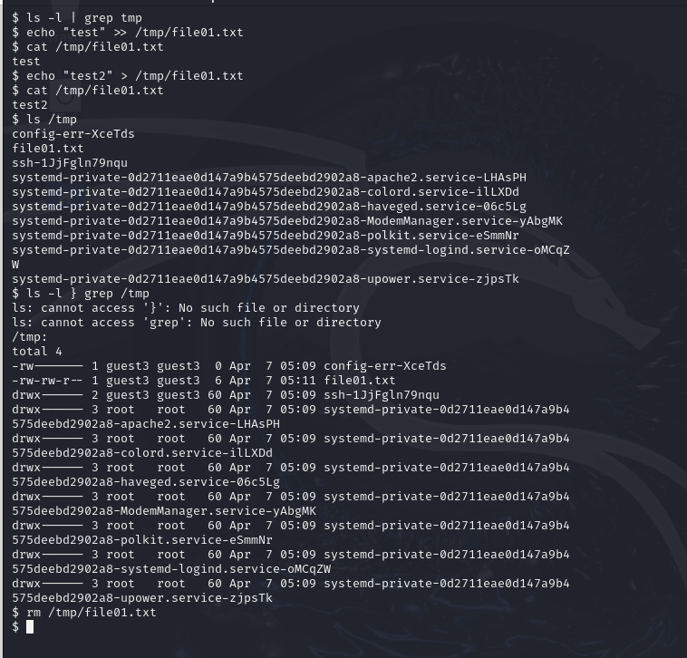

---
## Front matter
lang: ru-RU
title: Структура научной презентации
subtitle: Простейший шаблон
author:
  - Карпачев Я. О.
institute:
  - Российский университет дружбы народов, Москва, Россия

## i18n babel
babel-lang: russian
babel-otherlangs: english

## Formatting pdf
toc: false
toc-title: Содержание
slide_level: 2
aspectratio: 169
section-titles: true
theme: metropolis
header-includes:
 - \metroset{progressbar=frametitle,sectionpage=progressbar,numbering=fraction}
 - '\makeatletter'
 - '\beamer@ignorenonframefalse'
 - '\makeatother'
---

# Информация

## Докладчик

:::::::::::::: {.columns align=center}
::: {.column width="70%"}

  * Карпачев Я. О.
  * студент
  * Российский университет дружбы народов

:::
::: {.column width="30%"}

:::
::::::::::::::

# Вводная часть

## Цели и задачи

Изучение механизмов изменения идентификаторов, применения
SetUID- и Sticky-битов. Получение практических навыков работы в кон-
соли с дополнительными атрибутами. Рассмотрение работы механизма
смены идентификатора процессов пользователей, а также влияние бита
Sticky на запись и удаление файлов

## Выполняем команды данные в задании.

данные которые выводит программа совпадают с данными команды id, продвинутая программа единственная выводит 27(sudo) а не 1001(guest)

{#fig:001 width=70%}

## пишем программу readfile (simpleid3.c) и пытаемся исполнит ее с входными данными, после изменение владельца, выдается ошибка нет прав

{#fig:002 width=70%}

## подгатавливаем файл file01.txt к тестам в одном пользователи а потом меняем пользователя на guest3

{#fig:003 width=70%}

## со стороны guest3 все команды раьотают кроме удаления файла так нет прав

{#fig:004 width=70%}

## через садуера снимаем -t

{#fig:005 width=70%}

## проверям команды через guest3, все работает даже удаление файла

{#fig:006 width=70%}

## Вывод

Я научился применять механизмы изменения идентификаторов, примененять
SetUID- и Sticky-битов.
ции возможны при тех или иных установленных правах. Опробовал дей-
ствие на практике расширенных атрибутов «а» и «i»
