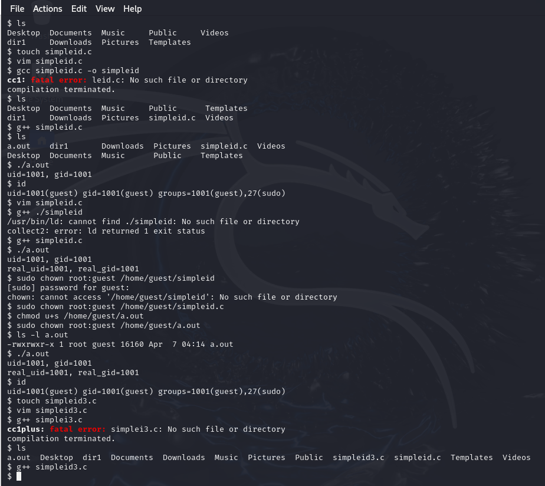
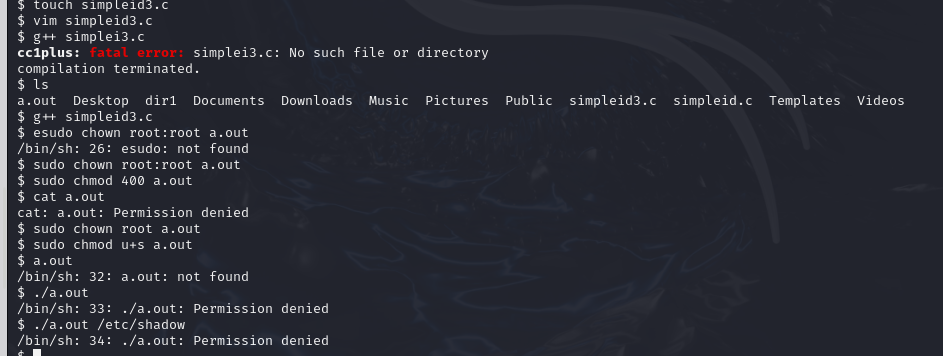
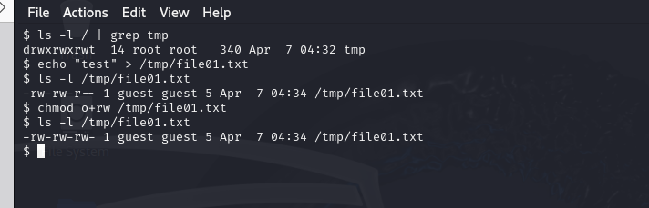
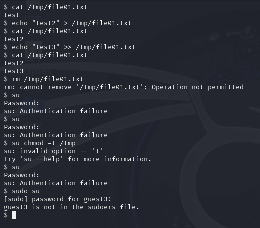
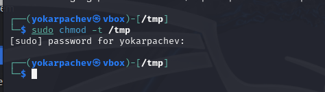
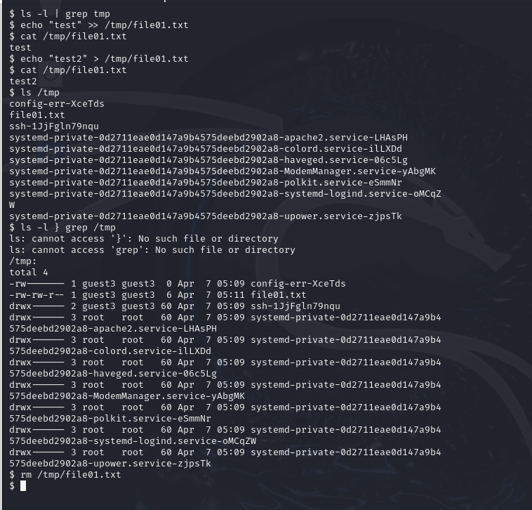

---
## Front matter
title: "Лабораторная 5"
subtitle: "Отчет"
author: "Карпачев Ярослав"

## Generic otions
lang: ru-RU
toc-title: "Содержание"

## Bibliography
bibliography: bib/cite.bib
csl: pandoc/csl/gost-r-7-0-5-2008-numeric.csl

## Pdf output format
toc: true # Table of contents
toc-depth: 2
lof: true # List of figures
lot: true # List of tables
fontsize: 12pt
linestretch: 1.5
papersize: a4
documentclass: scrreprt
## I18n polyglossia
polyglossia-lang:
  name: russian
  options:
	- spelling=modern
	- babelshorthands=true
polyglossia-otherlangs:
  name: english
## I18n babel
babel-lang: russian
babel-otherlangs: english
## Fonts
mainfont: PT Serif
romanfont: PT Serif
sansfont: PT Sans
monofont: PT Mono
mainfontoptions: Ligatures=TeX
romanfontoptions: Ligatures=TeX
sansfontoptions: Ligatures=TeX,Scale=MatchLowercase
monofontoptions: Scale=MatchLowercase,Scale=0.9
## Biblatex
biblatex: true
biblio-style: "gost-numeric"
biblatexoptions:
  - parentracker=true
  - backend=biber
  - hyperref=auto
  - language=auto
  - autolang=other*
  - citestyle=gost-numeric
## Pandoc-crossref LaTeX customization
figureTitle: "Рис."
tableTitle: "Таблица"
listingTitle: "Листинг"
lofTitle: "Список иллюстраций"
lotTitle: "Список таблиц"
lolTitle: "Листинги"
## Misc options
indent: true
header-includes:
  - \usepackage{indentfirst}
  - \usepackage{float} # keep figures where there are in the text
  - \floatplacement{figure}{H} # keep figures where there are in the text
---

# Цель работы

Изучение механизмов изменения идентификаторов, применения
SetUID- и Sticky-битов. Получение практических навыков работы в кон-
соли с дополнительными атрибутами. Рассмотрение работы механизма
смены идентификатора процессов пользователей, а также влияние бита
Sticky на запись и удаление файлов

# Задание

. Войдите в систему от имени пользователя guest.
2. Создайте программу simpleid.c:
36 Кулябов Д. С., Королькова А. В., Геворкян М. Н.
#include <sys/types.h>
#include <unistd.h>
#include <stdio.h>
int
main ()
{
uid_t uid = geteuid ();
gid_t gid = getegid ();
printf ("uid=%d, gid=%d\n", uid, gid);
return 0;
}
3. Скомплилируйте программу и убедитесь, что файл программы создан:
gcc simpleid.c -o simpleid
4. Выполните программу simpleid:
./simpleid
5. Выполните системную программу id:
id
и сравните полученный вами результат с данными предыдущего пункта
задания.
6. Усложните программу, добавив вывод действительных идентификато-
ров:
#include <sys/types.h>
#include <unistd.h>
#include <stdio.h>
int
main ()
{
uid_t real_uid = getuid ();
uid_t e_uid = geteuid ();
gid_t real_gid = getgid ();
gid_t e_gid = getegid () ;
printf ("e_uid=%d, e_gid=%d\n", e_uid, e_gid);
printf ("real_uid=%d, real_gid=%d\n", real_uid,
real_gid);↪→
return 0;
}
Получившуюся программу назовите simpleid2.c.
7. Скомпилируйте и запустите simpleid2.c:
gcc simpleid2.c -o simpleid2
./simpleid2
8. От имени суперпользователя выполните команды:
Информационная безопасность компьютерных сетей 37
chown root:guest /home/guest/simpleid2
chmod u+s /home/guest/simpleid2
9. Используйте sudo или повысьте временно свои права с помощью su.
Поясните, что делают эти команды.
10. Выполните проверку правильности установки новых атрибутов и смены
владельца файла simpleid2:
ls -l simpleid2
11. Запустите simpleid2 и id:
./simpleid2
id
Сравните результаты.
12. Проделайте тоже самое относительно SetGID-бита.
13. Создайте программу readfile.c:
#include <fcntl.h>
#include <stdio.h>
#include <sys/stat.h>
#include <sys/types.h>
#include <unistd.h>
int
main (int argc, char* argv[])
{
unsigned char buffer[16];
size_t bytes_read;
int i;
int fd = open (argv[1], O_RDONLY);
do
{
bytes_read = read (fd, buffer, sizeof (buffer));
for (i =0; i < bytes_read; ++i) printf("%c", buffer[i]);
}
while (bytes_read == sizeof (buffer));
close (fd);
return 0;
}
14. Откомпилируйте её.
gcc readfile.c -o readfile
15. Смените владельца у файла readfile.c (или любого другого текстового
файла в системе) и измените права так, чтобы только суперпользователь
(root) мог прочитать его, a guest не мог.
16. Проверьте, что пользователь guest не может прочитать файл readfile.c.
17. Смените у программы readfile владельца и установите SetU’D-бит.
18. Проверьте, может ли программа readfile прочитать файл readfile.c?
19. Проверьте, может ли программа readfile прочитать файл /etc/shadow?
Отразите полученный результат и ваши объяснения в отчёте.
38 Кулябов Д. С., Королькова А. В., Геворкян М. Н.
5.3.2. Исследование Sticky-бита
1. Выясните, установлен ли атрибут Sticky на директории /tmp, для чего
выполните команду
ls -l / | grep tmp
2. От имени пользователя guest создайте файл file01.txt в директории /tmp
со словом test:
echo "test" > /tmp/file01.txt
3. Просмотрите атрибуты у только что созданного файла и разрешите чте-
ние и запись для категории пользователей «все остальные»:
ls -l /tmp/file01.txt
chmod o+rw /tmp/file01.txt
ls -l /tmp/file01.txt
4. От пользователя guest2 (не являющегося владельцем) попробуйте про-
читать файл /tmp/file01.txt:
cat /tmp/file01.txt
5. От пользователя guest2 попробуйте дозаписать в файл
/tmp/file01.txt слово test2 командой
echo "test2" > /tmp/file01.txt
Удалось ли вам выполнить операцию?
6. Проверьте содержимое файла командой
cat /tmp/file01.txt
7. От пользователя guest2 попробуйте записать в файл /tmp/file01.txt
слово test3, стерев при этом всю имеющуюся в файле информацию ко-
мандой
echo "test3" > /tmp/file01.txt
Удалось ли вам выполнить операцию?
8. Проверьте содержимое файла командой
cat /tmp/file01.txt
9. От пользователя guest2 попробуйте удалить файл /tmp/file01.txt ко-
мандой
rm /tmp/fileOl.txt
Удалось ли вам удалить файл?
10. Повысьте свои права до суперпользователя следующей командой
su -
и выполните после этого команду, снимающую атрибут t (Sticky-бит) с
директории /tmp:
chmod -t /tmp
11. Покиньте режим суперпользователя командой
exit
12. От пользователя guest2 проверьте, что атрибута t у директории /tmp
нет:
ls -l / | grep tmp
13. Повторите предыдущие шаги. Какие наблюдаются изменения?
14. Удалось ли вам удалить файл от имени пользователя, не являющегося
его владельцем? Ваши наблюдения занесите в отчёт.
Информационная безопасность компьютерных сетей 39
15. Повысьте свои права до суперпользователя и верните атрибут t на ди-
ректорию /tmp:
su -
chmod +t /tmp
exit

# Выполнение лабораторной работы

1. Выполняем команды данные в задании.

данные которые выводит программа совпадают с данными команды id, продвинутая программа единственная выводит 27(sudo) а не 1001(guest)

{#fig:001 width=70%}

2. пишем программу readfile (simpleid3.c) и пытаемся исполнит ее с входными данными, после изменение владельца, выдается ошибка нет прав

{#fig:002 width=70%}

3. подгатавливаем файл file01.txt к тестам в одном пользователи а потом меняем пользователя на guest3

{#fig:003 width=70%}

4. со стороны guest3 все команды раьотают кроме удаления файла так нет прав

{#fig:004 width=70%}

5. через садуера снимаем -t

{#fig:005 width=70%}

6. проверям команды через guest3, все работает даже удаление файла

{#fig:006 width=70%}

# Выводы

Я научился применять механизмы изменения идентификаторов, примененять
SetUID- и Sticky-битов.
ции возможны при тех или иных установленных правах. Опробовал дей-
ствие на практике расширенных атрибутов «а» и «i»
