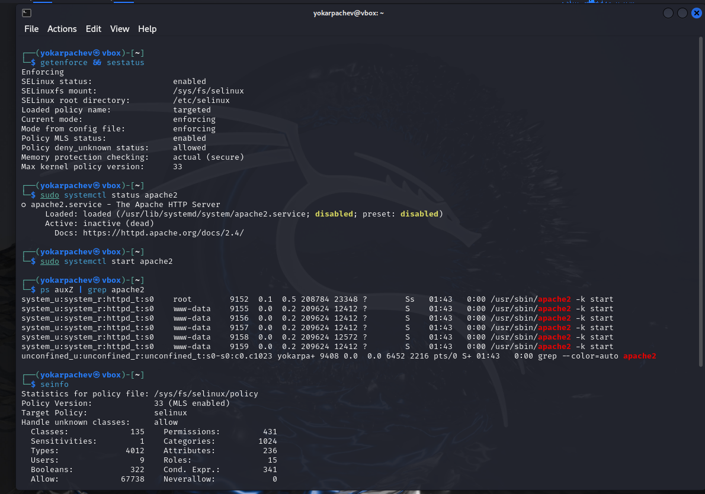
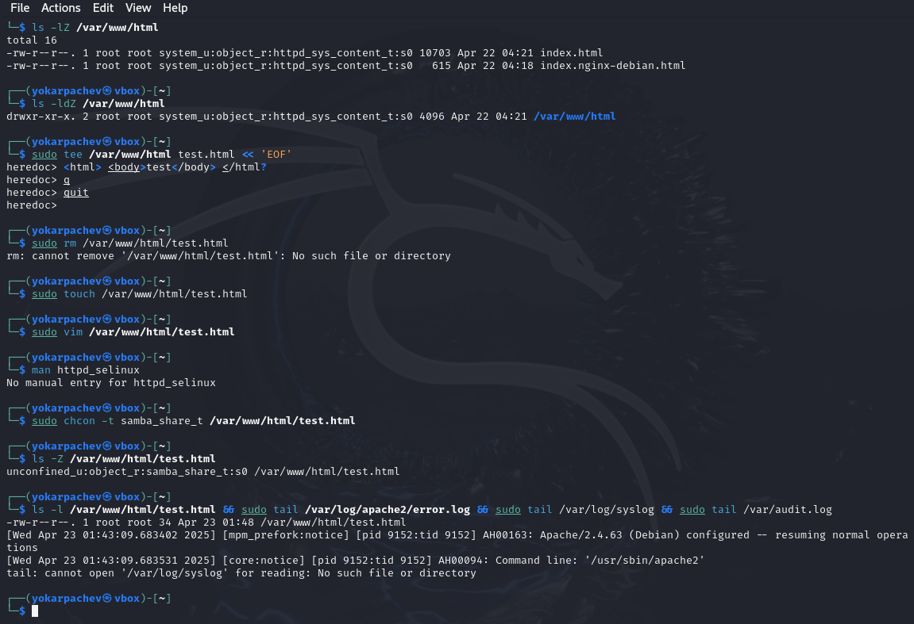
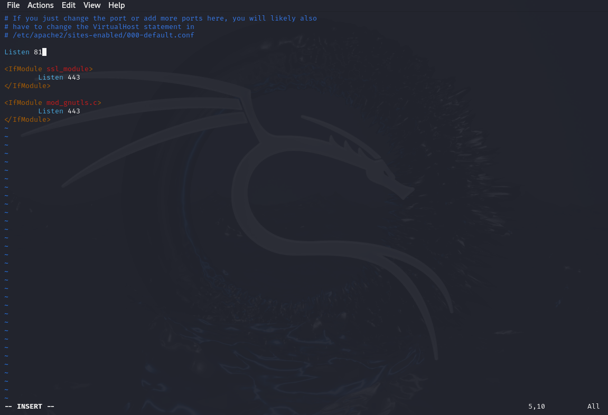
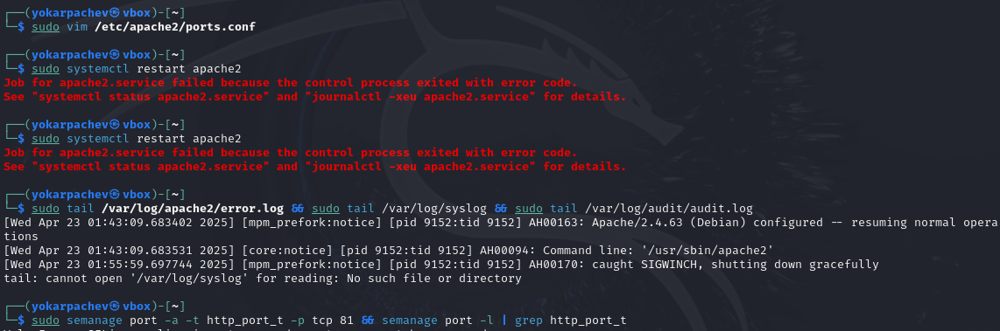

---
## Front matter
lang: ru-RU
title: Структура научной презентации
subtitle: Простейший шаблон
author:
  - Карпачев Я. О.
institute:
  - Российский университет дружбы народов, Москва, Россия

## i18n babel
babel-lang: russian
babel-otherlangs: english

## Formatting pdf
toc: false
toc-title: Содержание
slide_level: 2
aspectratio: 169
section-titles: true
theme: metropolis
header-includes:
 - \metroset{progressbar=frametitle,sectionpage=progressbar,numbering=fraction}
 - '\makeatletter'
 - '\beamer@ignorenonframefalse'
 - '\makeatother'
---

# Информация

## Докладчик

:::::::::::::: {.columns align=center}
::: {.column width="70%"}

  * Карпачев Я. О.
  * студент
  * Российский университет дружбы народов

:::
::: {.column width="30%"}

:::
::::::::::::::

# Вводная часть

## Цели и задачи

Развить навыки администрирования ОС Linux. Получить первое прак-
тическое знакомство с технологией SELinux1.
Проверить работу SELinx на практике совместно с веб-сервером
Apache

## Выполняем команды данные в задании.

## Проверяем статус getenforce и sestatus запускаем сервер находим его среди процессов.

{#fig:001 width=70%}

## Анализируем файлы которые находятся в директории

(проверка прав и того кто может создавать файлы в директории), созлем html файл записываем туда структуру, открываем веб браузер и убеждаемся test видим

{#fig:003 width=70%}

## заходим в конфиг apache сервера и меняем порт на 81 попытка перезапустить сервер вернет нам ошибку

{#fig:004 width=70%}

## необходимо добаввить порт 81 в зону httpd 

при перезапуске теперь все будет работать, затем удалеям соответсвие порта 81 и наш тестовый файл test.html

{#fig:005 width=70%}

## Выводы

Я научился применять механизмы одминистрирования в ОС линукс и познакомился с SELinux
