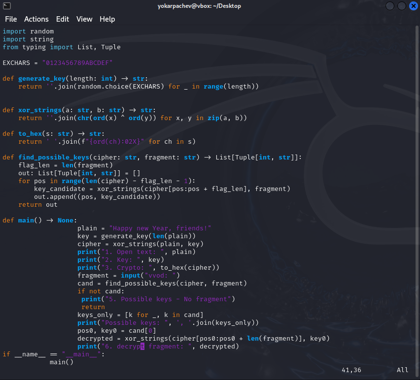
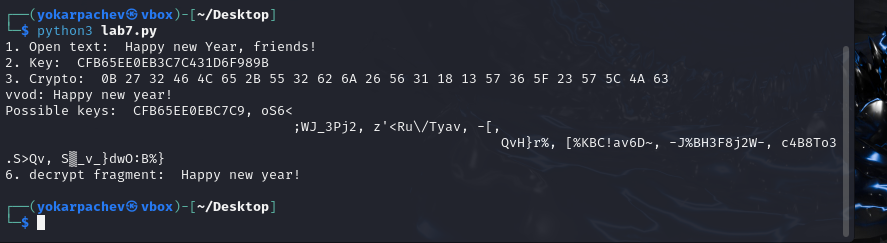

---
## Front matter
lang: ru-RU
title: Структура научной презентации
subtitle: Простейший шаблон
author:
  - Карпачев Я. О.
institute:
  - Российский университет дружбы народов, Москва, Россия

## i18n babel
babel-lang: russian
babel-otherlangs: english

## Formatting pdf
toc: false
toc-title: Содержание
slide_level: 2
aspectratio: 169
section-titles: true
theme: metropolis
header-includes:
 - \metroset{progressbar=frametitle,sectionpage=progressbar,numbering=fraction}
 - '\makeatletter'
 - '\beamer@ignorenonframefalse'
 - '\makeatother'
---

# Информация

## Докладчик

:::::::::::::: {.columns align=center}
::: {.column width="70%"}

  * Карпачев Я. О.
  * студент
  * Российский университет дружбы народов

:::
::: {.column width="30%"}

:::
::::::::::::::

# Цель работы

Освоить на практике применение режима однократного гаммирования

# Выполнение лабораторной работы

## Пишим скрипт

{#fig:001 width=70%}

## проверяем работу программы

{#fig:002 width=70%}

## Контрольные вопросы

1. Смысл однократного гаммирования – сложение (XOR) текста с однократной случайной гаммой той же длины.
 2. Недостатки: нужна истинно случайная гамма; ключ хранить/передавать так же долго, как сообщение; ключ нельзя переиспользовать.
 3. Преимущества: абсолютная криптостойкость; простота реализации; симметричность (шифр = дешифр).
 4. Длины равны, чтобы каждый символ текста «прикрывался» одним символом гаммы; иначе остаётся статистическая избыточность.
 5. Операция – XOR (сложение по модулю 2); даёт ‑– при повторном применении тем же ключом восстанавливается исходник.
 6. Шифротекст: C_i = P_i \oplus K_i.
 7. Ключ: K_i = C_i \oplus P_i.
 8. Условия абсолютной стойкости: (a) гамма истинно случайна; (b) длина ключа = длина сообщения; (c) ключ используется лишь однажды.

## Выводы

Я освоить на практике применение режима однократного гаммирования
