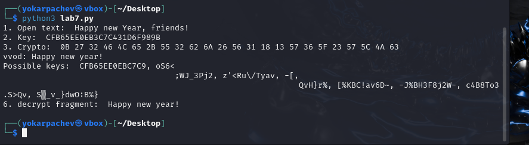

---
## Front matter
title: "Лабораторная 7"
subtitle: "Отчет"
author: "Карпачев Ярослав"

## Generic otions
lang: ru-RU
toc-title: "Содержание"

## Bibliography
bibliography: bib/cite.bib
csl: pandoc/csl/gost-r-7-0-5-2008-numeric.csl

## Pdf output format
toc: true # Table of contents
toc-depth: 2
lof: true # List of figures
lot: true # List of tables
fontsize: 12pt
linestretch: 1.5
papersize: a4
documentclass: scrreprt
## I18n polyglossia
polyglossia-lang:
  name: russian
  options:
	- spelling=modern
	- babelshorthands=true
polyglossia-otherlangs:
  name: english
## I18n babel
babel-lang: russian
babel-otherlangs: english
## Fonts
mainfont: PT Serif
romanfont: PT Serif
sansfont: PT Sans
monofont: PT Mono
mainfontoptions: Ligatures=TeX
romanfontoptions: Ligatures=TeX
sansfontoptions: Ligatures=TeX,Scale=MatchLowercase
monofontoptions: Scale=MatchLowercase,Scale=0.9
## Biblatex
biblatex: true
biblio-style: "gost-numeric"
biblatexoptions:
  - parentracker=true
  - backend=biber
  - hyperref=auto
  - language=auto
  - autolang=other*
  - citestyle=gost-numeric
## Pandoc-crossref LaTeX customization
figureTitle: "Рис."
tableTitle: "Таблица"
listingTitle: "Листинг"
lofTitle: "Список иллюстраций"
lotTitle: "Список таблиц"
lolTitle: "Листинги"
## Misc options
indent: true
header-includes:
  - \usepackage{indentfirst}
  - \usepackage{float} # keep figures where there are in the text
  - \floatplacement{figure}{H} # keep figures where there are in the text
---

# Цель работы

Освоить на практике применение режима однократного гаммирования

# Задание

Нужно подобрать ключ, чтобы получить сообщение «С Новым Годом,
друзья!». Требуется разработать приложение, позволяющее шифровать и
дешифровать данные в режиме однократного гаммирования. Приложение
должно:
1. Определить вид шифротекста при известном ключе и известном откры-
том тексте.
2. Определить ключ, с помощью которого шифротекст может быть преоб-
разован в некоторый фрагмент текста, представляющий собой один из
возможных вариантов прочтения открытого текста.

# Выполнение лабораторной работы

1. Пишим скрипт

``` python
#!/usr/bin/env python3
# -*- coding: utf-8 -*-
import random
import string
from typing import List, Tuple

EXCHARS = "0123456789ABCDEF"


def generate_key(length: int) -> str:
    """Return pseudo‑random printable HEX‑like string of *length* symbols."""
    return ''.join(random.choice(HEXCHARS) for _ in range(length))


def xor_strings(a: str, b: str) -> str:
    """XOR two equal‑length strings, return new string of chars."""
    return ''.join(chr(ord(x) ^ ord(y)) for x, y in zip(a, b))


def to_hex(s: str) -> str:
    """Convert string → 'AA BB CC' spaced HEX representation."""
    return ' '.join(f"{ord(ch):02X}" for ch in s)


def find_possible_keys(cipher: str, fragment: str) -> List[Tuple[int, str]]:
    frag_len = len(fragment)
    out: List[Tuple[int, str]] = []
    for pos in range(len(cipher) - frag_len + 1):
        key_candidate = xor_strings(cipher[pos:pos + frag_len], fragment)
        out.append((pos, key_candidate))
    return out


def main() -> None:
    plain = "С Новым Годом, друзья!"

    key = generate_key(len(plain))

    cipher = xor_strings(plain, key)

    print("1. Open text      :", plain)
    print("2. Key            :", key)
    print("3. Crypto text    :", to_hex(cipher))

    fragment = input("4. Input fragment : ")

    cand = find_possible_keys(cipher, fragment)
    if not cand:
        print("5. Possible keys  : — (фрагмент не найден)")
        return

    keys_only = [k for _, k in cand]
    print("5. Possible keys  :", ', '.join(keys_only))

    pos0, key0 = cand[0]
    decrypted = xor_strings(cipher[pos0:pos0 + len(fragment)], key0)
    print("6. Decrypted frag.:", decrypted)


if name == "__main__":
    main()
```

2. проверяем работу программы

{#fig:001 width=70%}

3. Контрольные вопросы

1. Смысл однократного гаммирования – сложение (XOR) текста с однократной случайной гаммой той же длины.
 2. Недостатки: нужна истинно случайная гамма; ключ хранить/передавать так же долго, как сообщение; ключ нельзя переиспользовать.
 3. Преимущества: абсолютная криптостойкость; простота реализации; симметричность (шифр = дешифр).
 4. Длины равны, чтобы каждый символ текста «прикрывался» одним символом гаммы; иначе остаётся статистическая избыточность.
 5. Операция – XOR (сложение по модулю 2); даёт ‑– при повторном применении тем же ключом восстанавливается исходник.
 6. Шифротекст: C_i = P_i \oplus K_i.
 7. Ключ: K_i = C_i \oplus P_i.
 8. Условия абсолютной стойкости: (a) гамма истинно случайна; (b) длина ключа = длина сообщения; (c) ключ используется лишь однажды.


# Выводы

Я освоить на практике применение режима однократного гаммирования
