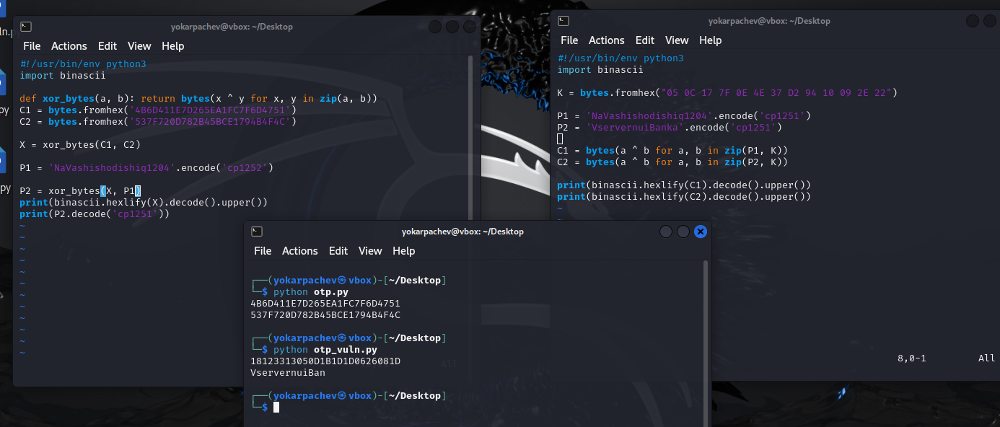

---
## Front matter
lang: ru-RU
title: Структура научной презентации
subtitle: Простейший шаблон
author:
  - Карпачев Я. О.
institute:
  - Российский университет дружбы народов, Москва, Россия

## i18n babel
babel-lang: russian
babel-otherlangs: english

## Formatting pdf
toc: false
toc-title: Содержание
slide_level: 2
aspectratio: 169
section-titles: true
theme: metropolis
header-includes:
 - \metroset{progressbar=frametitle,sectionpage=progressbar,numbering=fraction}
 - '\makeatletter'
 - '\beamer@ignorenonframefalse'
 - '\makeatother'
---

# Информация

## Докладчик

:::::::::::::: {.columns align=center}
::: {.column width="70%"}

  * Карпачев Я. О.
  * студент
  * Российский университет дружбы народов

:::
::: {.column width="30%"}

:::
::::::::::::::

# Цель работы

Освоить на практике режим однократного гаммирования (одноразового шифрования) на примере кодирования двух различных телеграмм одним ключом и продемонстрировать уязвимость повторного использования ключа.

# Шифрование и получение шифротекстов

Кодирование двух исходных телеграмм P₁ и P₂ одним ключом K с помощью операции XOR.

## Демонстрация уязвимости: получение двух открытых текстов без знания ключа

Повторное использование ключа при шифровании P₁ и P₂ позволяет злоумышленнику, зная C₁ и C₂, получить P₁⊕P₂:

Повторное использование ключа при шифровании P₁ и P₂ позволяет злоумышленнику, зная C₁ и C₂, получить P₁⊕P₂:

$C1 \oplus C2 = P1 \oplus K \oplus P2 \oplus K = P1 \oplus P2.$

Если P₁ известен (например, шаблонный текст), то:

$P2 = (C1 \oplus C2) \oplus P1.$

Вычисление C1⊕C2 и получение P₂ при известном P₁.

## Программы и вывод

{#fig:001 width=70%}

## Выводы

1. Повторное использование одного и того же ключа при режиме гаммирования приводит к опасной уязвимости: злоумышленник, имея два шифротекста, может получить XOR двух открытых текстов.
2. Зная один из открытых текстов (шаблон), можно полностью восстановить второй без знания ключа.
3. Ключ в режиме одноразовой гаммы должен использоваться лишь один раз; повторное использование делает шифрование небезопасным.
