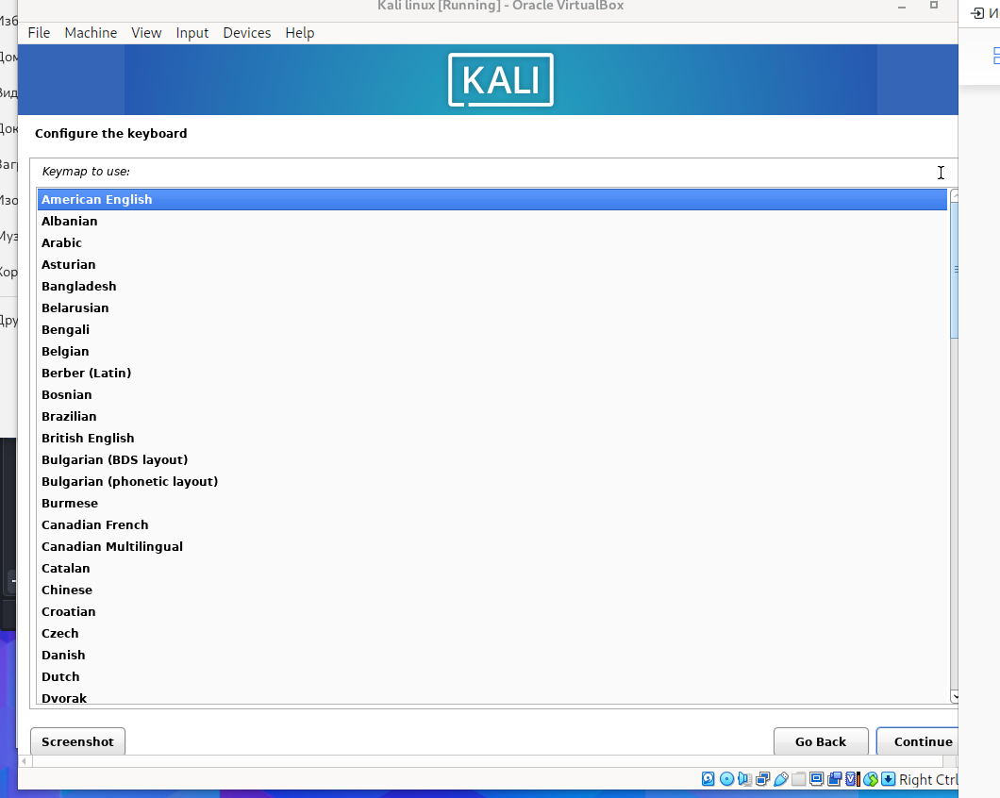
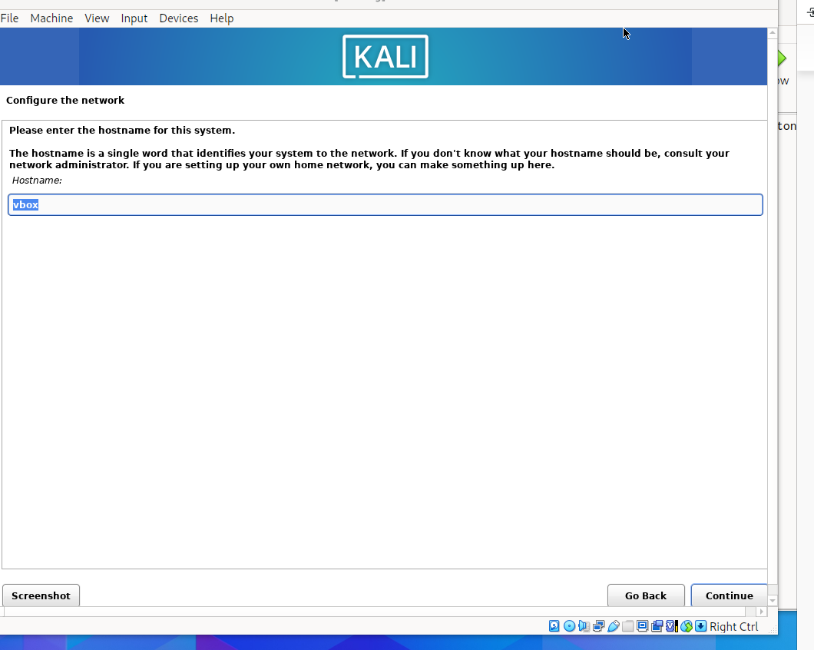
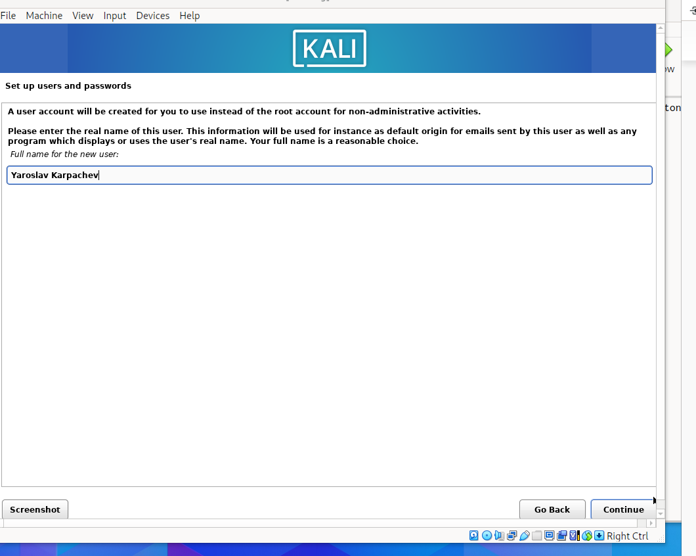
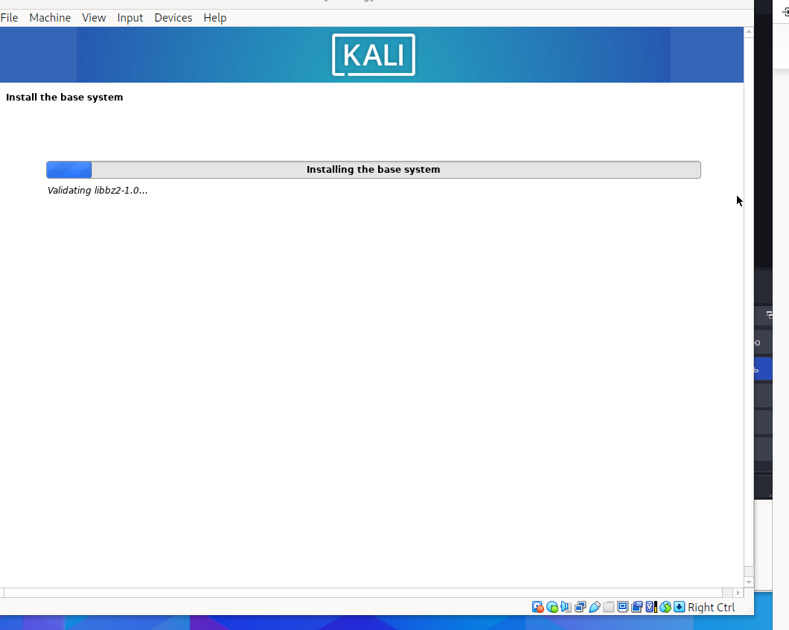
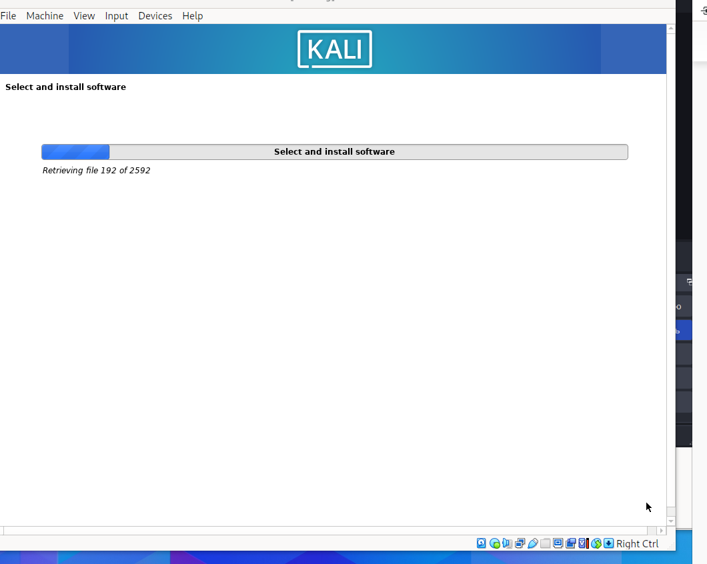
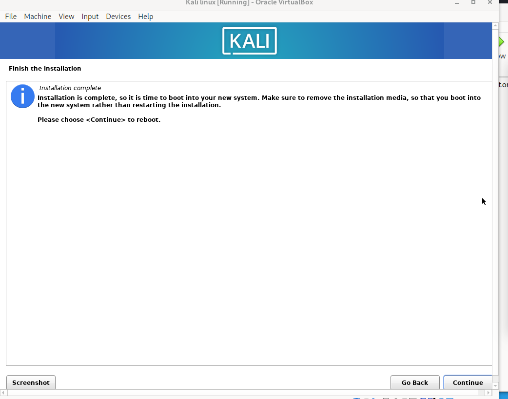
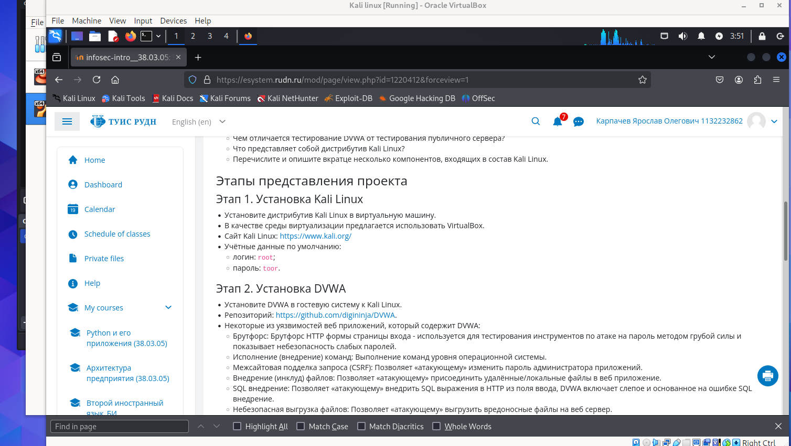

---
## Front matter
lang: ru-RU
title: Структура научной презентации
subtitle: Простейший шаблон
author:
  - Карпачев Я. О.
institute:
  - Российский университет дружбы народов, Москва, Россия

## i18n babel
babel-lang: russian
babel-otherlangs: english

## Formatting pdf
toc: false
toc-title: Содержание
slide_level: 2
aspectratio: 169
section-titles: true
theme: metropolis
header-includes:
 - \metroset{progressbar=frametitle,sectionpage=progressbar,numbering=fraction}
 - '\makeatletter'
 - '\beamer@ignorenonframefalse'
 - '\makeatother'
---

# Информация

## Докладчик

:::::::::::::: {.columns align=center}
::: {.column width="70%"}

  * Карпачев Я. О.
  * студент
  * Российский университет дружбы народов

:::
::: {.column width="30%"}

:::
::::::::::::::

# Вводная часть

## Цели и задачи

Установите дистрибутив Kali Linux в виртуальную машину.
В качестве среды виртуализации предлагается использовать VirtualBox.
Сайт Kali Linux: https://www.kali.org/

1. Найти образ (скачать так чтобы он был полным а не поврежденным)
2. сделайть настройку Vbox
3. провести установку системы настроек и тд
4. Запустить виртуалку и убидиться что действительно работает

## Этап 1

1. Скачиваем образ iso с сайта kali linux (https://www.kali.org/get-kali/#kali-installer-images)

# Этап 2

2. Вставляем образ в Vbox выбераем подтип uduntu (4096cpu 3core 42gb)

# Этап 3

3. Запуска выполняем иструкции - устанавливаем язык, выбераем имя хоста, имя юзера, устанавливам сначала систему, потом выбераем дефолтные иструменты и устанавливам их тоже

# Этап 3

{#fig:001 width=70%}

# Этап 3

{#fig:002 width=70%}

# Этап 3

{#fig:003 width=70%}

# Этап 3

{#fig:004 width=70%}

# Этап 3

{#fig:005 width=70%}

# Этап 3

{#fig:006 width=70%}

# Этап 4

4. Перезапускам и проверям что все верноустановленно (зашел на сайт RUDN со своим акком)

{#fig:007 width=70%}

