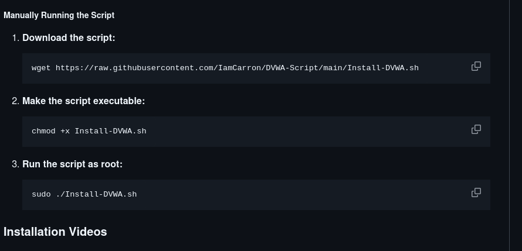

---
## Front matter
lang: ru-RU
title: Структура научной презентации
subtitle: Простейший шаблон
author:
  - Карпачев Я. О.
institute:
  - Российский университет дружбы народов, Москва, Россия

## i18n babel
babel-lang: russian
babel-otherlangs: english

## Formatting pdf
toc: false
toc-title: Содержание
slide_level: 2
aspectratio: 169
section-titles: true
theme: metropolis
header-includes:
 - \metroset{progressbar=frametitle,sectionpage=progressbar,numbering=fraction}
 - '\makeatletter'
 - '\beamer@ignorenonframefalse'
 - '\makeatother'
---

# Информация

## Докладчик

:::::::::::::: {.columns align=center}
::: {.column width="70%"}

  * Карпачев Я. О.
  * студент
  * Российский университет дружбы народов

:::
::: {.column width="30%"}

:::
::::::::::::::

# Вводная часть

## Цель работы

Установите DVWA на виртуальную машину
Github DVWA - https://github.com/digininja/DVWA

## Этап 1

Берем Гитхаб есть в стадиях проекта ТУИС - (/afs/.dk.sci.pfu.edu.ru/home/y/o/yokarpachev/work/study_2025/personal-project/stage2/report/report.docx)

## Этап 2

Находим инструкции

{#fig:000 width=70%}

## Этап 3

Вставляем инстукции в терминал

{#fig:001 width=70%}

## Этап 3

{#fig:002 width=70%}

## Этап 3

{#fig:003 width=70%}

## Этап 4

{#fig:004 width=70%}

# Выводы

Я уствновил DVWA на виртуальную машину и провель верную первоначальную настройку DVWA
