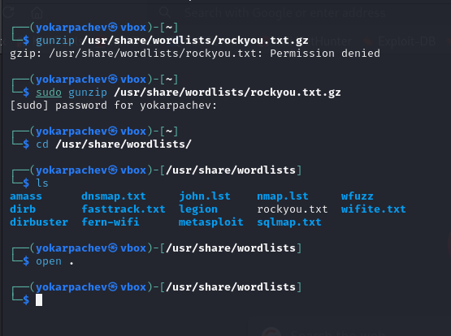
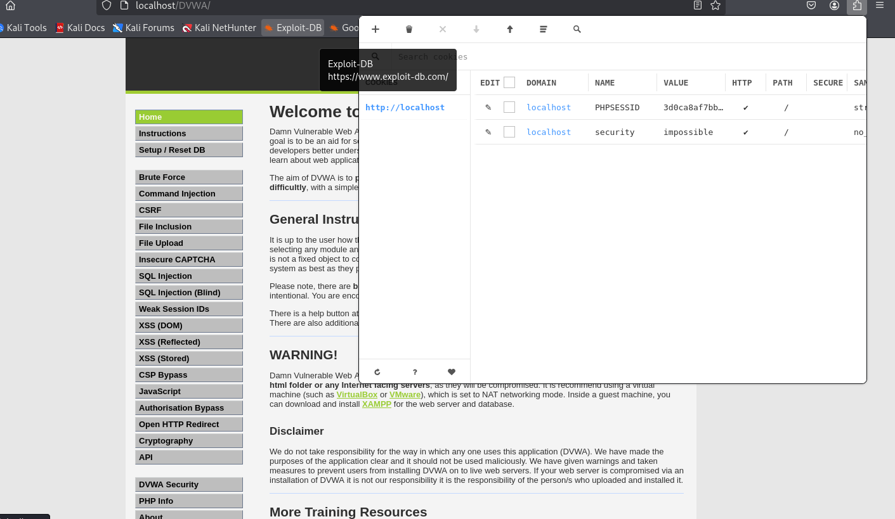
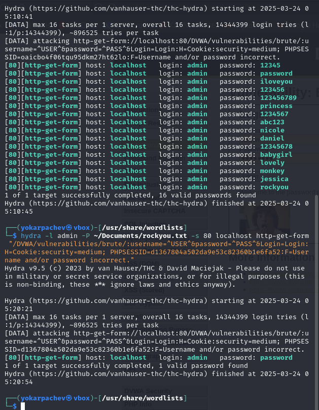
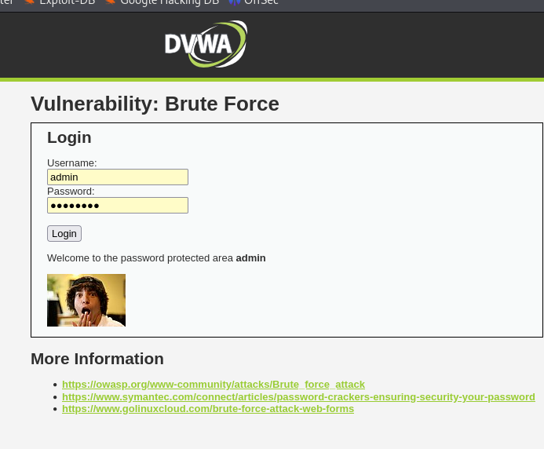

---
## Front matter
lang: ru-RU
title: Структура научной презентации
subtitle: Простейший шаблон
author:
  - Карпачев Я. О.
institute:
  - Российский университет дружбы народов, Москва, Россия

## i18n babel
babel-lang: russian
babel-otherlangs: english

## Formatting pdf
toc: false
toc-title: Содержание
slide_level: 2
aspectratio: 169
section-titles: true
theme: metropolis
header-includes:
 - \metroset{progressbar=frametitle,sectionpage=progressbar,numbering=fraction}
 - '\makeatletter'
 - '\beamer@ignorenonframefalse'
 - '\makeatother'
---

# Информация

## Докладчик

:::::::::::::: {.columns align=center}
::: {.column width="70%"}

  * Карпачев Я. О.
  * студент
  * Российский университет дружбы народов

:::
::: {.column width="30%"}

:::
::::::::::::::

# Вводная часть

## Цель работы

С помощью Hydra взломать пароль (в данном случае DVWA который мы получили при установки приложения)

## Анзипаем встроенный список с паролями для брут форса - rockyou.txt

{#fig:000 width=70%}

## Для того чтобы получить точку доступа скачиваем любой cooky анализатор и используем его на форме

{#fig:000 width=70%}

## С помощью данных параметров запускаем команду и ждем ее завершения

{#fig:001 width=70%}

## Проверяем что все пароль действительно правильный

{#fig:004 width=70%}

# Выводы

Я понял как брутфорсить HTML формы
