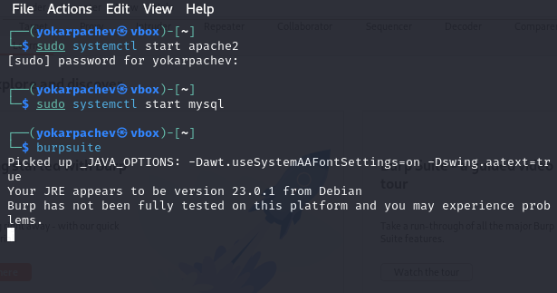
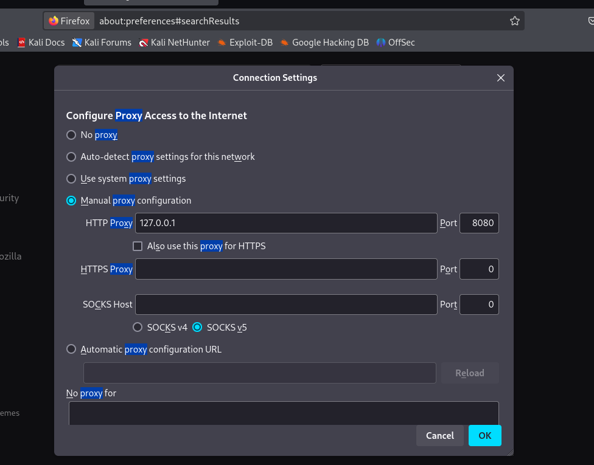
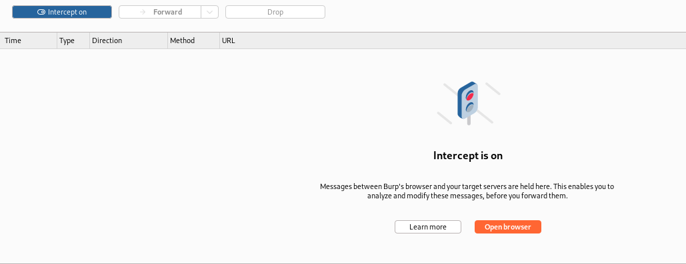
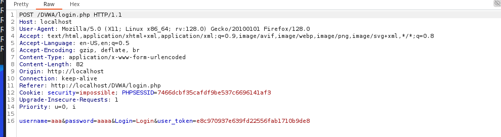
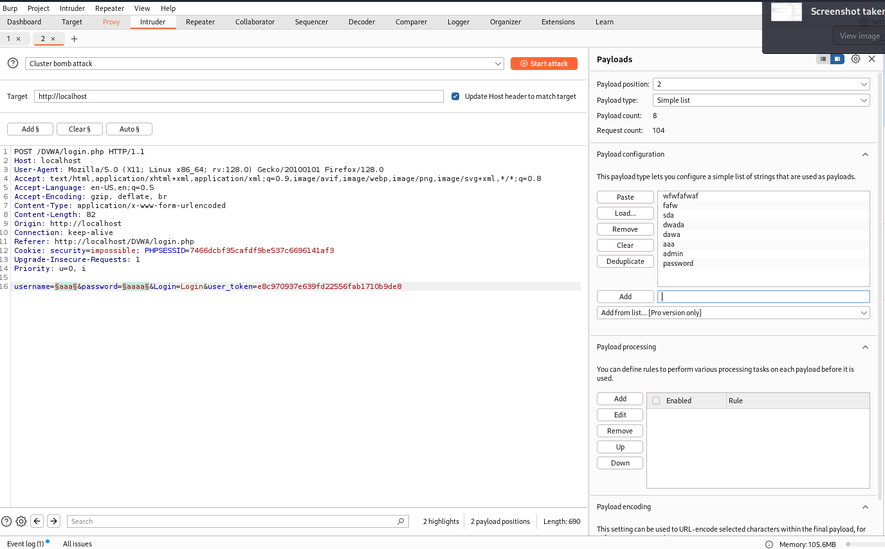
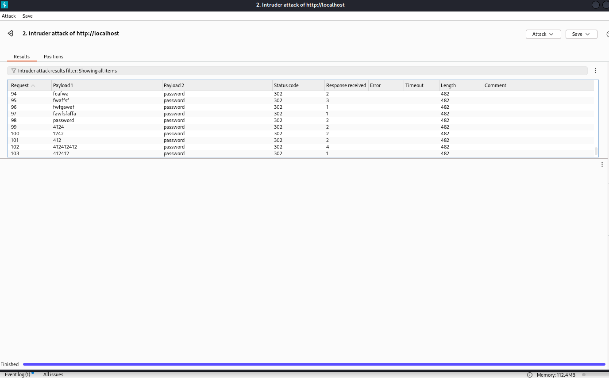
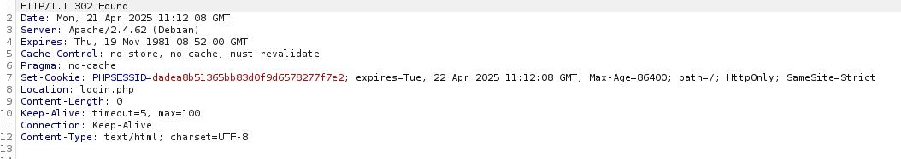
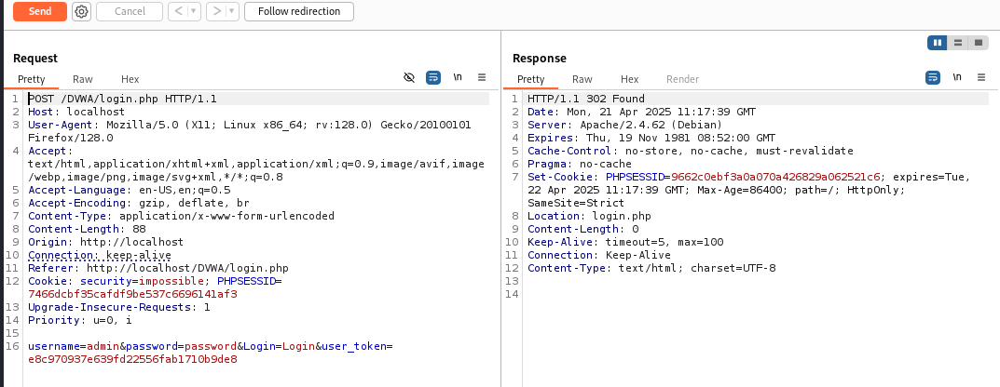

---
## Front matter
lang: ru-RU
title: Структура научной презентации
subtitle: Простейший шаблон
author:
  - Карпачев Я. О.
institute:
  - Российский университет дружбы народов, Москва, Россия

## i18n babel
babel-lang: russian
babel-otherlangs: english

## Formatting pdf
toc: false
toc-title: Содержание
slide_level: 2
aspectratio: 169
section-titles: true
theme: metropolis
header-includes:
 - \metroset{progressbar=frametitle,sectionpage=progressbar,numbering=fraction}
 - '\makeatletter'
 - '\beamer@ignorenonframefalse'
 - '\makeatother'
---

# Информация

## Докладчик

:::::::::::::: {.columns align=center}
::: {.column width="70%"}

  * Карпачев Я. О.
  * студент
  * Российский университет дружбы народов

:::
::: {.column width="30%"}

:::
::::::::::::::

# Вводная часть

## Цель работы

Взломать пароль с помощью Burp Suit

# Выполнение лабораторной работы

## запускаем две команды одна для mysql, другая для apache2, а также сам Burp Suit

{#fig:001 width=70%}

## настраиваем окружение

{#fig:002 width=70%}

{#fig:003 width=70%}

{#fig:004 width=70%}

## перехватываем нужный запрос

{#fig:006 width=70%}

## готовим атаку

{#fig:007 width=70%}

## запускаем атаку

{#fig:008 width=70%}

## находим запрос который отличается

{#fig:009 width=70%}

## ретланслируем

{#fig:0010 width=70%}

## Выводы

я научился использовать burp suit для взлома паролей

